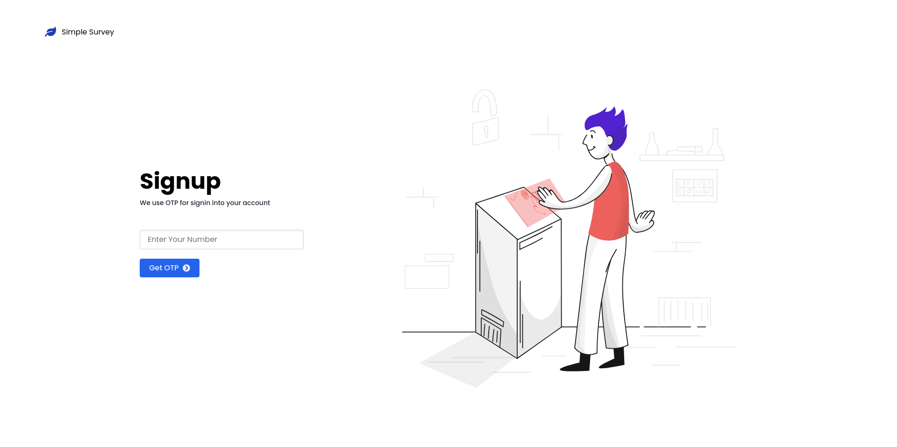

# [Trinkerr Assignment](https://trinkerr-assignment.vercel.app/)

This is a submission for trinkerr front-end task for Front-End position

- [Applied To ↗](https://springrecruit.com/applyNow/Trinkerr1572)
- [Demo on Vercel ↗](https://trinkerr-assignment.vercel.app/)

## Tech Stack

- [**React**](https://reactjs.org/) - Create React App
- [**Tailwind CSS**](https://tailwindcss.com/) - CSS Utility Framework
- [**Framer Motion**](https://www.framer.com/docs/) - Animation Framework
- [**React Hot Toast**](https://react-hot-toast.com/) - Toast Notifications
- [**React Router**](https://reactrouter.com/) - Declarative Routing
- [**Jest**](https://jestjs.io/) - Unit Testing Framework
- [**Cypress**](https://www.cypress.io/) - E2E (End To End) Testing Framework

## Instruction

```bash
git clone https://github.com/HarsimranBarki/trinkerr-assignment
cd trinkerr-assignment
npm install
npm run start
```

Now visit [http://localhost:8000](http://localhost:8000)


